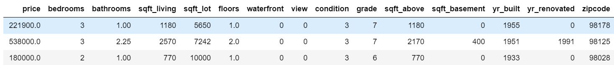
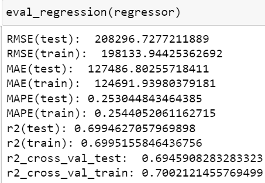
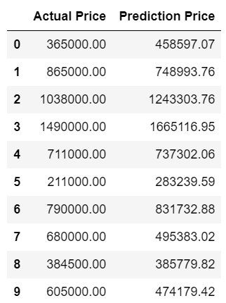
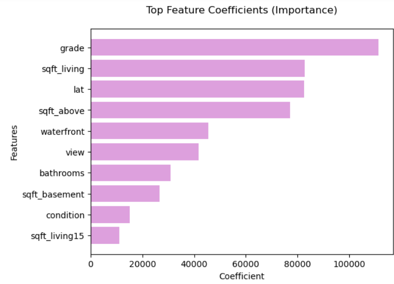

# Machine Learning Project of House Price Prediction

## Project Description

The House Price Prediction project involves the development of a machine learning model to predict residential property prices based on various features. Utilizing a dataset containing information such as square footage, number of bedrooms, location details, and other relevant attributes, the project aims to build an accurate and reliable predictive model.

**Challenges :**  
Build a machine learning model that can predict House Price Prediction.

## Project Goal

The project goals is to provide valuable insights for homebuyers, real estate agents, and property investors in understanding and estimating house prices.

## Tools & Library Used

 &nbsp;
 &nbsp;

## Project Result

[Click here to get full code](https://github.com/nickenshidqia/House_Price_Prediction/blob/50d7ddab4844e568f11130b522d206c97cc5192c/House%20Price%20Prediction.ipynb)

### Dataset Used

  
Even though in this dataset, there is categorical values, for example waterfront, and view columns, but it's already in numeric version (1, 0). So we do not need to do label encoding, just standardization using StandardScaler.

### Modelling

I already tried several algorithm such as :

- Linear Regression
- Hyperparameter Tuning using Ridge, Lasso, and ElasticNet
- Decision Tree
- Random Forest
- Support Vector Regressor

But The **Best Evaluation Score** is using **Linear Regression model**.  

- The r2 score between the train data and test data is not far, so the model does not overfit.
- The error from this model is small 25%.

### House Price Prediction using Best Model

From the best model, we could predict the House Price using Linear Regression :

  
  
### Feature Importance of House Price Prediction 
  
   
 Top 10 of features that have the most significant impact on the predicted target variable :
1. 'grade',
2. 'sqft_living',
3. 'lat',
4. 'sqft_above',
5. 'waterfront',
6. 'view',
7. 'bathrooms',
8. 'sqft_basement',
9. 'condition',
10. 'sqft_living15',
